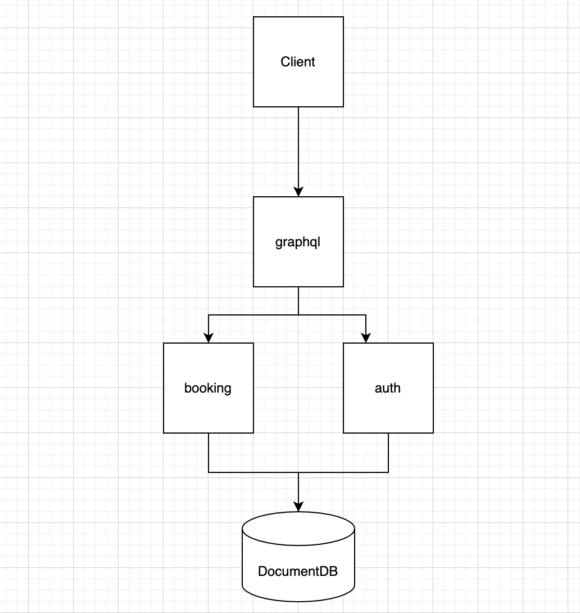

# Superb Site Reliability Engineering Challenge

A fun and practical test for the SRE position at Superb.

## Introduction

Superb is growing. Today we have 4 applications organized in a [monorepo](https://en.wikipedia.org/wiki/Monorepo). They are:

- **[auth](./auth/)**: An HTTP API used to register and authenticate users that will use our platform. This is a high audience service and must have attention with it.
- **[booking](./booking/)**: A gRPC API responsible by manage restaurant bookings.
- **[graphql](./graphql/)**: This API is our border service. It make the bridge between frontend applications and our microservices.
- **[client](./client/)**: This API is a frontend app used to manage bookings.

## Application diagram

## Prerequisites

1. An AWS account
2. region `Paris (eu-west-3)`
3. A valid route53 domain name - ie: `superb.io`

#### Install AWS CLI
1. Install AWS CLI
2. Get AWS CLI credentials
3. Go to AWS Console: IAM
4. Create a user that have `AdministratorAccess` IAM permission with access types Access key - Programmatic access and Password - AWS Management Console access
5. Select Security Credentials
6. Select Access Key ID and Secret access key
7. Configure AWS CLI, run aws configure using above parameters.

#### Create AWS resources from AWS console

1. An S3 bucket to host terraform infrastructure state named `fs-superb-app-state`.
2. An S3 bucket for frontend builds and use its name as `S3_REPOSITORY` value to github secrets.
3. A DynamoDB table to handle state locking named `superb-dynamodb-state-lock` and should have primary key `LOCK_ID`.
4. An IAM user that have `AmazonS3FullAccess` IAM permission to build the frontend, use his security credentials as `S3_ACCESS_KEY` and `S3_SECRET_ACCESS_KEY` values to github secrets.
5. Get AWS certificate ARN for `superb.io` in `us-east-1` region and export its value as `ACM_ARN_PROD` to github secrets.
6. Create 3 following parameters in AWS Parameter Store as `SecureString` to host database credentials:
   - `/backend/mongo/dbname` 
   - `/backend/mongo/username`
   - `/backend/mongo/password`
7. Create the following ECR repositories to host docker images:
   - auth: use its ARN to create `AUTH_REPO` secret in github.
   - booking: use its ARN to create `BOOKING_REPO` secret in github.
   - graphql: use its ARN to create `GRAPHQL_REPO` secret in github.
   - client
   - client-dev

#### Install Docker
You will need to install Docker and Docker Compose to get the app running locally in your machine.

#### Setup Github actions user

1. Go to AWS Console: IAM
2. Select Add users with only access type Access key - Programmatic access
3. Select Next Permissions
4. Select Create policy and give the user the custom IAM permission inside `github-policy/github-policy.json`
5. Select Access Key ID and Secret access key
6. Create two github secrets `AWS_ACCESS_KEY_ID` and `AWS_SECRET_ACCESS_KEY` using above parameters.

## CICD implementation
We have one main github actions workflow named `deploy to production` that is triggered on push to `main` and will deploy a full production environment composed by:
-  A managed DocumentDB mongo database.
-  An ECS cluster that will host the backend services (graphql, booking and auth).
-  A load balancer to expose graphql service to the frontend client.
-  And S3 bucket linked to a cloud front distribution that will host the frontend client.

## Clean the Stack
We have a wokflow named `Remove production environment` that can be run manually in order to destroy the whole provisioned environment.
